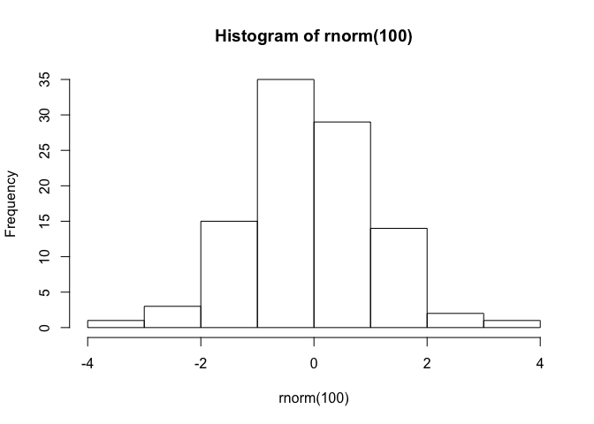

    hist(rnorm(100))

Stat 479: Data Science with R
=============================

UW-Madison
----------

### Spring 2020

### Karl Rohe

email: first name and last name at stat dott wisc dott edu  
office: 1239 MSC  
[Topics outline](TopicsOutline.pdf), [Syllabus](syl479s20.pdf), [Project
Description](../ProjectDescription.html), [R labs in ISLR](labs.R).

### Week 4

1.  Where we are going.... After the next bit of code we do on handling
    relational data, we will have an in class exercise where you will
    get the BLS unemployment data into R (by county fips code). You can
    use any method you wish to get it into R (bonus points for the
    easiest code). [Here is the raw
    data](https://www.bls.gov/web/metro/laucntycur14.txt). Then, for
    each county, make a tidy data set that tells us some things about
    the bridges in the county and their labor force size (one of the
    columns in the BLS data).
2.  [Handling relational data.](../code/playgrounds.R) Chapter 5 in
    r4ds.  
3.  Do bullet point 1!

#### Reading

[Chapter 13](https://r4ds.had.co.nz/relational-data.html)

### Week 3

#### Warm-up

In the flights data, use [filter, group\_by, summarize, and
plot](../code/handling.R) (in one line, perhaps in a different order).

#### Topics

1.  [Bitcoin is
    data](https://cran.r-project.org/web/packages/Rbitcoin/)  
2.  Recap of [handling/wrangling data with dplyr](../code/handling.R).
3.  When you are using agile syntax, what is your
    [stance/mode-of-being](../lectures/stances.html)? (this is a "trick
    question" that is fundamental to this course.)
4.  if you have a SQL database, you can use
    [dbplyr](https://dbplyr.tidyverse.org). It allows you to use remote
    database tables as if they are in-memory data frames by
    automatically converting dplyr code into SQL. There are [a lot of
    other extensions for other database ish
    things.](https://gist.github.com/piccolbo/3d8ac40291f4eaee644b)
5.  [organizing](../code/organizing.R), or "tidying" your data.

#### Reading

This week, [Chapter 12](https://r4ds.had.co.nz/tidy-data.html). Next
week, [Chapter 13](https://r4ds.had.co.nz/relational-data.html).

#### Homework

Turn in the bridges homework on github by Friday of this week.

Your github repo should have your code that downloads the data. Then,
dplyrs it into a ggplot. Put that code and plot into an Rmarkdown.

To upload a github readme that compiles the figures in your
RMarkdown....

1.  change output to rmarkdown::github\_document  
2.  knit
3.  delete old README.md
4.  change name of .md file to README.md
5.  commit and push both the new README.md and the <name>\_files
    directory that contains the figures.

### Week 2

#### Recap

1.  What mode-of-being are we in for the bridges homework?  
2.  What are some key steps/elements/suggestions for importing difficult
    datasets?  
3.  What is validation?

#### Topics

1.  [Handling/wrangling data with dplyr](../code/handling.R). In these
    excercises, we manipulate a 40 MB file (330k rows and 19 columns).
    For each of the operations, you should already know a "substitute"
    that you could code already. As such, there is a fixed cost to
    learning something new. Moreover, the benefits will not be
    immediately aparent until we study `%>%`. It is worth it, I promise.
2.  In the flights data, use filter, group\_by, summarize, and plot (in
    one line, perhaps in a different order).
3.  Get one line of code to filter, group\_by, summarize, and plot
    something from bridges.

#### Homework

Get set up! [Join our
classroom!](https://classroom.github.com/classrooms/25160858-ds479s20)
[Install git, use in RStudio, make github account, download repo, commit
and push repo.](../lectures/github.html)

Here is [the first homework](https://classroom.github.com/a/4SC06sxf). I
previously said it would be due in week 2. However, let's delay until
next week. That way, we can talk about github on Thursday.

#### Reading

[Chapter 5 in r4ds](https://r4ds.had.co.nz).

### Week 1

#### Topics

1.  If you think we should be discussing a topic in class, let me know!
    If you want to present that topic, bonus points for you! Literally!
2.  [Outcome envisioning](../lectures/digitalPortfolio.html). I am not
    going to hold your hand through all of these steps. Instead, think
    of this course as a key resource that, if used effectively, will
    help you create your own digital portfolio.
3.  [Five Stances of Data Science](../lectures/stances.html)  
4.  [Data Science is a performance of these
    stances](../lectures/performance.html)  
5.  "Five stances" and "DS is a performance" could have been said about
    "applied statistics" 50 years ago. Is "DS" just marketing? (1) who
    cares. (2) the "rebranding" has aligned (in time) with a massive
    change in the way that we perform applied statistics. [To me, Data
    Science is data analysis in the age of the internet. This has two
    major implications.](../lectures/firstLecture.html)  
6.  Course pedagogy: I will rarely lecture (like I just did). Instead,
    we will have labs that we will perform individually, in small
    groups; everyone is coding there own code, but we are discussing in
    small groups. These labs will often have landmines (things which you
    don't yet know how to do) and forks in the road (decisions that you
    must make). I want you to navigate these things your selves, in
    small groups. I will not give you the answers, because the aim is
    not to teach you how to do these isolated tasks. Rather, it is to
    help you figure out how to do things by yourselves. This is
    convenient because I am sometimes just as puzzled as you are! :) We
    will figure it out together. If this sound tedious or if you would
    prefer tidy lectures, I would advise you to stick around and try it!
    However, you are also welcome to find another class. If you are
    stuck here for graduation requirements and this all sounds like a
    nightmare, please let me know. Truely.  
7.  [Syllabus](syl479s20.pdf)  
8.  [Topics outline](TopicsOutline.pdf)  
9.  Reading data is hard, particularly when it comes from "outside".
    Let's try to [read some bad data](../code/readingBadData.R).  
10. That bad data is just a warm up to [the real warm
    up](assignments/Bridges.html). Download some [bridges
    data](https://www.fhwa.dot.gov/bridge/nbi/ascii.cfm).  
11. Project idea: study [how physicians move around the
    country](http://onlinelibrary.wiley.com/doi/10.1111/hesr.2017.52.issue-S1/issuetoc)
    over time. [Loading the data is a nice
    challenge](http://download.cms.gov/nppes/NPI_Files.html) because you
    can fiddle with the web addresses to get "diff files".

### Readings

Chapters 11 and then 5 in r4ds. You are required to do these readings.
If you do not, then class will not be fun.

#### Text:

[*R for Data Science*](http://r4ds.had.co.nz)  
by Garrett Grolemund and Hadley Wickham

[*An Introduction to Statistical Learning with Applications in
R*](http://www-bcf.usc.edu/~gareth/ISL/)  
by Gareth James, Daniela Witten, Trevor Hastie and Robert Tibshirani

#### Helpful links

1.  [Download r4ds](http://r4ds.had.co.nz)  
2.  [Download islr](http://www-bcf.usc.edu/~gareth/ISL/) and lab
    codes.  
3.  Refresh material: [An Introduction to
    R](http://cran.r-project.org/doc/manuals/R-intro.pdf)  
4.  [Advanced R](http://adv-r.had.co.nz) by Hadley Wickham  
5.  Making beautiful documents with [R
    markdown](http://rmarkdown.rstudio.com) and
    [knitR](http://kbroman.org/knitr_knutshell/). Here are
    [some](../ht/rmarkdown-cheatsheet.pdf) helpful
    [links](../ht/rmarkdown-reference.pdf).
6.  Data from the [American Community
    Survey](http://en.wikipedia.org/wiki/American_Community_Survey)
    using R library acs. First, [get api
    key](http://api.census.gov/data/key_signup.html)
